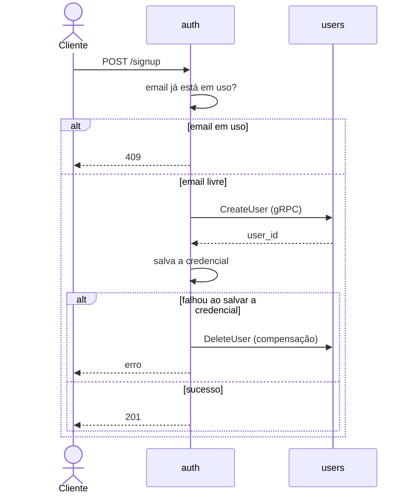

# Netflix Microservices

Um clone simplificado da Netflix feito para **estudo**: aprender arquitetura de microsserviços, trabalhar com mais de uma stack e, mais adiante, Kubernetes.

> Projeto pessoal de aprendizado, sem nenhuma ligação com a Netflix. O foco é a arquitetura, não o produto.

## Objetivos

- Separar um sistema em serviços independentes, cada um com seu próprio banco e deploy
- Comunicação entre serviços via gRPC, com contratos versionados
- Praticar Go (serviços novos) ao lado de Node/TypeScript
- Testar cada serviço isoladamente, sem depender dos outros rodando
- Empacotar tudo com Docker e, numa fase futura, rodar em Kubernetes

## Arquitetura

| Serviço | Stack | Responsabilidade | Status |
| --- | --- | --- | --- |
| `servers/auth` | Go | Credenciais (um usuário pode ter várias: email, Google, telefone...), login, tokens e JWKS. Orquestra o cadastro | Em construção |
| `servers/users` | Node/TS | Dono do ID do usuário; nome e contato | Em construção |
| gateway | Go | Entrada única, validação de JWT via JWKS, BFF | Futuro |
| catalog | Node/TS | Títulos, gêneros e busca | Futuro |
| `web` | React + Vite | Frontend | Futuro |

Princípios:

- **Externo em HTTP/JSON, interno em gRPC.** Os contratos ficam em `contracts/`.
- **Um Postgres por serviço.** Nenhum serviço acessa o banco de outro, e não existe chave estrangeira entre serviços.
- **Nada é importado diretamente de outro serviço.** O que é compartilhado vive nos contratos.
- **JWT validado localmente** via JWKS, sem chamada de rede ao `auth` a cada request.

### Fluxo de cadastro

O cadastro é uma saga orquestrada e síncrona, conduzida pelo `auth`. O usuário é criado primeiro porque o ID pertence a ele; a credencial é só uma das formas de login.



O email de contato (no `users`) pode ser diferente do email de login (no `auth`).

## Estrutura do repositório

```text
.
├── contracts/        # arquivos .proto compartilhados (gRPC)
├── docs/
│   └── decisions/    # ADRs: o porquê de cada decisão
├── servers/
│   ├── auth/         # Go
│   └── users/        # Node/TS
└── docker-compose.yml
```

Cada serviço é um projeto independente: tem seu próprio build, Dockerfile, testes, banco e `CLAUDE.md`.

## Como rodar

> Em construção. Quando a fase 1 estiver pronta, o sistema inteiro sobe com:

```bash
cp .env.example .env
docker compose up
```

Pré-requisitos previstos: Docker, Go, Node.js e [buf](https://buf.build).

## Testes

Cada serviço testa a si mesmo, sem depender de outro serviço rodando:

- **Unitários:** só a lógica; banco e gRPC são substituídos por falsos
- **Integração:** contra o Postgres do próprio serviço, com [Testcontainers](https://testcontainers.com)
- **E2E do serviço:** o serviço rodando com o próprio banco, e os outros serviços substituídos por falsos gerados do mesmo `.proto`

A compatibilidade entre serviços é garantida pelo contrato (`buf breaking`). O fluxo completo é conferido por um smoke test manual com `docker compose up`.

## Roadmap

- [ ] **Fase 1: Cadastro.** `auth` + `users`, gRPC, Postgres por serviço, Docker e testes
- [ ] **Fase 2: Login e tokens.** JWT e JWKS no `auth`
- [ ] **Fase 3: Gateway.** Entrada única em Go, validando JWT localmente
- [ ] **Fase 4: Catálogo.** Títulos, gêneros e busca
- [ ] **Fase 5: Frontend.** React + Vite
- [ ] **Fase 6: Kubernetes**

Adiado de propósito: retry e circuit breaker, rate limit, tracing, zero trust e validação de email.

## Decisões

As decisões de arquitetura ficam registradas como ADRs em [`docs/decisions/`](docs/decisions/), cada uma com contexto, decisão, alternativas e consequências.

## Configuração

Toda configuração vem de variáveis de ambiente. Segredos ficam só no `.env`, que não vai para o git; o repositório traz um `.env.example` sem segredos.
